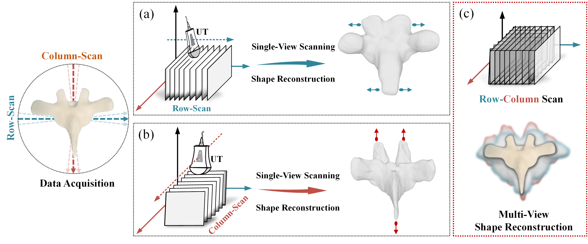
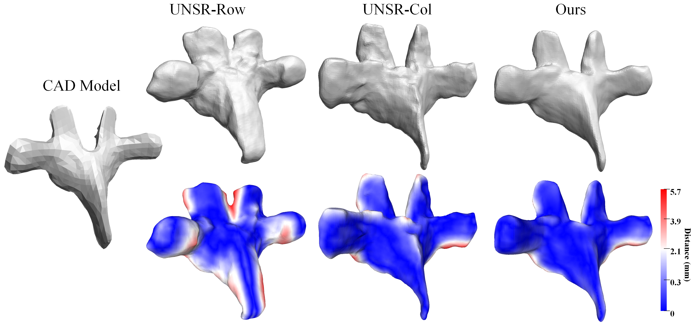

## RoCoSDF: Row-Column Scanned Neural Signed Distance Fields for Freehand 3D ultrasound Imaging Shape Reconstruction
--------------------------------------

The official implementation code for MICCAI 2024 paper:
RoCoSDF: Row-Column Scanned Neural Signed Distance Fields for Freehand 3D Ultrasound Imaging Shape Reconstruction
by [Hongbo Chen](https://chenhbo.github.io/), Yuchong Gao, Shuhang Zhang, Jiangjie Wu, [Yuexin Ma](https://yuexinma.me/) and [Rui Zheng](https://sist.shanghaitech.edu.cn/zhengrui_en/main.htm).


RoCoSDF is a framework built on neural implicit signed distance functions for shape reconstruction of multi-view freehand 3D ultrasound imaging.

<div align="center">

</div>


## Demo
* Thoracic Vertebra T4 from ultrasound transducer 1 (UT1)

<div align="center">

</div>


<br />


* The example mesh results of RoCoSDF are in `outs/T4_RoCo/outputs/*.ply`.


--------------------------------------

## Usage
Our code is implemented in Python 3.8, PyTorch 1.12.1 and CUDA 11.6


### Install Dependencies 
```
conda create -n rocosdf python=3.8
conda activate rocosdf
conda install pytorch==1.12.1 torchvision==0.13.1 torchaudio==0.12.1 cudatoolkit=11.6 -c pytorch -c conda-forge
pip install tqdm pyhocon==0.3.57 trimesh PyMCubes scipy matplotlib
pip install visdom open3d scikit-image plyfile
```

--------------------------------------

### Data Preparation
- Convert the row-scan and column-scan segmented volumetric mask to point clouds file *.ply.

- Both the row-scan and column-scan point clouds should be in a same tracking 
space or manually aligned in a unified space.

- Put the row-scan and column-scan point clouds data in ./data.

```
RoCoSDF/
│
├── data/
│   ├── T4_Co.ply            % your own data
|   ├── T4_Ro.ply            % your own data
│   ├── T4_Co_ds.pt          % generated during data preprocessing, downsampled point clouds for training
|   ├── T4_Ro_ds.pt          % generated during data preprocessing, downsampled point clouds for training
│   ├── T4_Co_sampler.pt     % generated during training
|   ├── T4_Ro_sampler.pt     % generated during training
|
|
├── outs/
│   ├── T4_Co/
│       └── outputs/
|           └── *.ply
│   ├── T4_Ro/
│       └── outputs/
|            └── *.ply
│   ├── T4_RoCo/
│       └── outputs/
|            └── *.ply
|
```

--------------------------------------

### Run RoCoSDF
In Linux, directly train the model through `sh train.sh` OR using command as below.

```
python runRoCoSDF.py --gpu 0  --conf confs/conf.conf --dataname T4_Co --dataname2 T4_Ro  --dir T4_Co --dir2 T4_Ro --dir3 T4_RoCo --mode train
 ```


### Run SDF Refinement Only
In Linux, directly train the model through `sh train_refine_only.sh` OR using command as below.

```
python runRoCoSDF.py --gpu 0  --conf confs/conf.conf --dataname T4_Co --dataname2 T4_Ro --dir T4_Co --dir2 T4_Ro --dir3 T4_RoCo --mode train_refine
 ```

### Contact
For any queries, please contact [chenhb[at]shanghaitech.edu.cn](mailto:chenhb@shanghaitech.edu.cn).

--------------------------------------

### References
The reference codes are from the following links.
We appreciate all the contributors.

* DeepSDF: https://github.com/facebookresearch/DeepSDF

* NeuralPull: https://github.com/mabaorui/NeuralPull-Pytorch

* GenSDF: https://github.com/princeton-computational-imaging/gensdf

* CSGSDF: https://github.com/zoemarschner/csg_on_nsdf
